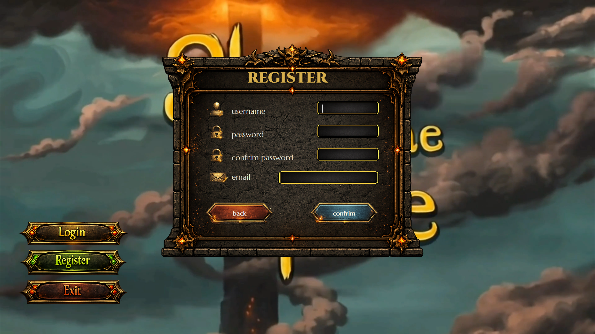
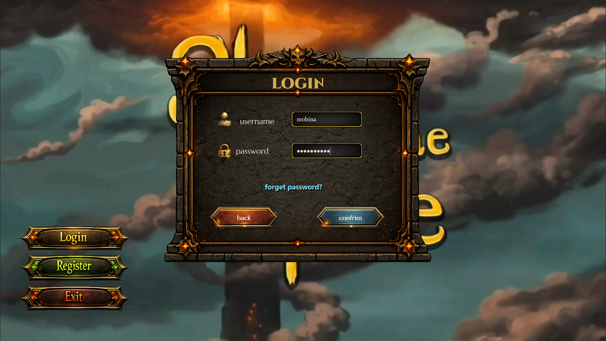
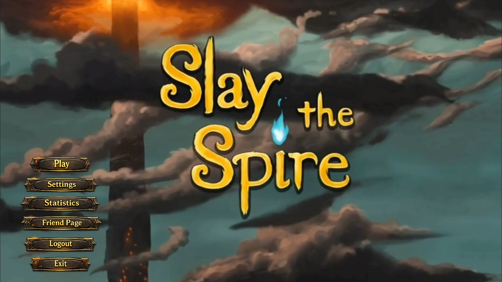
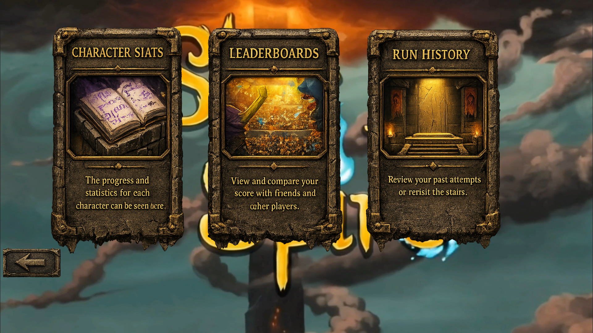
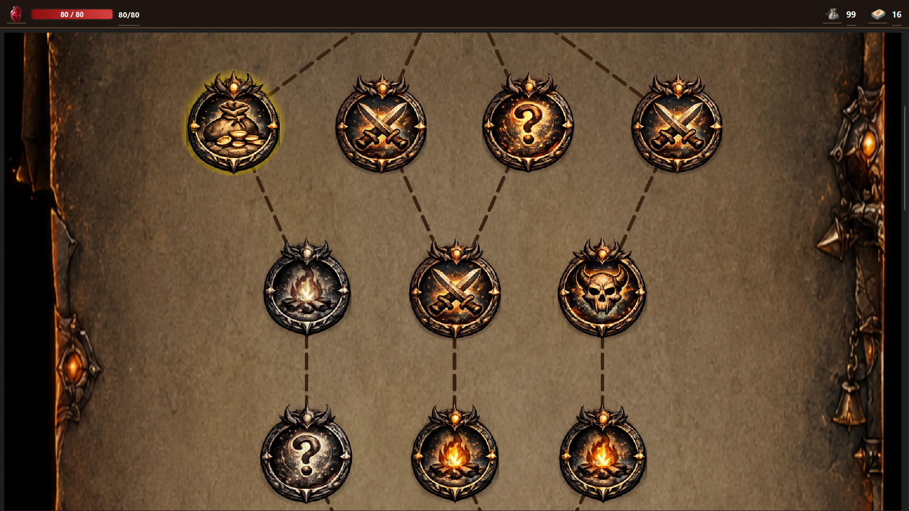
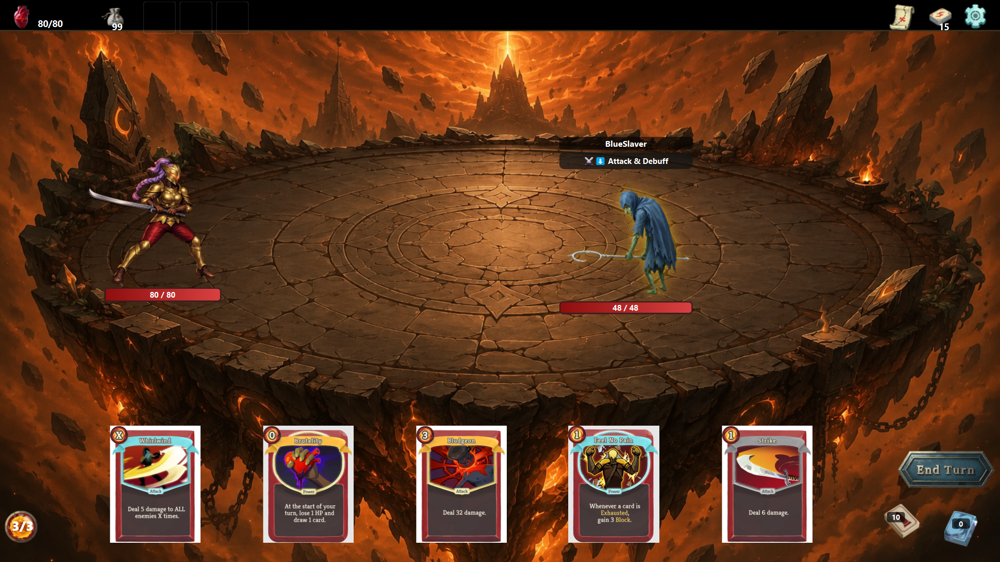
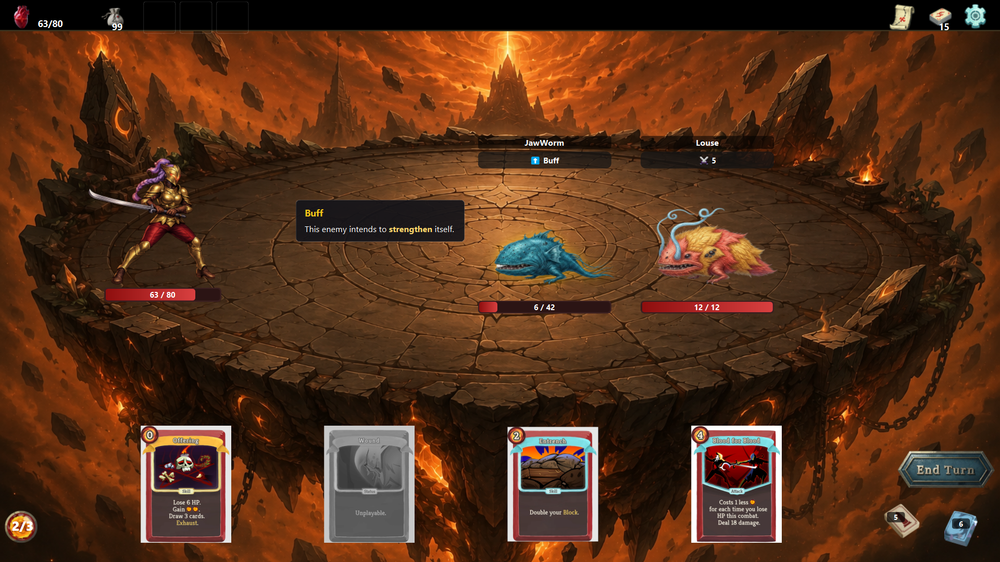
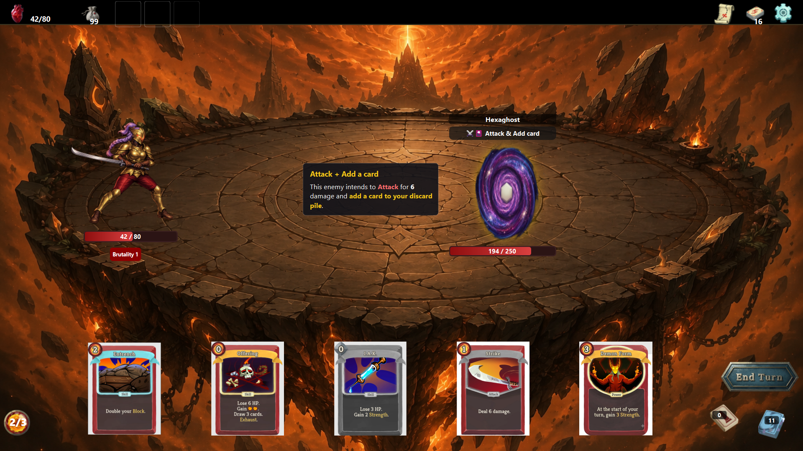

# 🃏 Slay the Spire — C++ / Qt

A card-based roguelike game inspired by **Slay the Spire**, developed as a team project for the **Advanced Programming course at IUT** using **C++, Qt 6, SQLite, and TCP networking**.

The project includes game mechanics, user authentication, a database system, social features, leaderboards, and multiplayer functionality.

---

## ✨ Features

* 🎮 Card-based combat system
* ⚔️ Turn-based battles
* 👾 Enemy system
* 🧙 Character selection
* 🏆 Score & leaderboard system
* 👤 User registration and login
* 👥 Friends system
* 💾 SQLite database
* 🌐 TCP-based multiplayer
* 🖥️ Qt graphical user interface
* 📊 Game progression and statistics

---

## 🛠️ Tech Stack

* **C++**
* **Qt 6**
* **CMake**
* **SQLite**
* **Qt SQL**
* **Qt Network**
* **TCP**
* **Git & GitHub**

---

## 🏗️ Architecture

The project is organized into several main components:

```text
             ┌─────────────────┐
             │    Qt UI Layer  │
             └────────┬────────┘
                      │
                      ▼
             ┌─────────────────┐
             │   Game Logic    │
             └───────┬─────────┘
                     │
              ┌──────┴──────┐
              ▼             ▼
       ┌────────────┐ ┌────────────┐
       │  SQLite DB │ │ Networking │
       │   Qt SQL   │ │    TCP     │
       └────────────┘ └────────────┘
```

---

## 📸 Screenshots










---

## ⚙️ Installation & Running

### Requirements

Make sure the following are installed:

* **Qt 6**
* **C++ Compiler** (MinGW or MSVC)
* **CMake**
* **Git**
* **SQLite**

### Clone the Repository

```bash
git clone https://github.com/mobinaebrahim/Slay-The-Spire.git
cd Slay-The-Spire
```

### Build the Project

```bash
mkdir build
cd build
cmake ..
cmake --build .
```

### Run

After the build process is completed, run the generated executable.

> The exact build and run steps may vary depending on your operating system, compiler, and Qt configuration.

### Multiplayer

To use the multiplayer functionality:

1. Start the server.
2. Start the client application.
3. Connect the client to the server.
4. Start or join a multiplayer session.

---

## 👥 Team

This project was developed by **Mobina Ebrahim** and **Dina Bagherzade** for the **Advanced Programming course at IUT**.

---


## 📜 Disclaimer

This project is an independent educational implementation inspired by **Slay the Spire** and is not affiliated with or endorsed by its original developers.

---

## ❤️ Acknowledgements

Inspired by **Slay the Spire** by **Mega Crit**.

Built for educational purposes.
